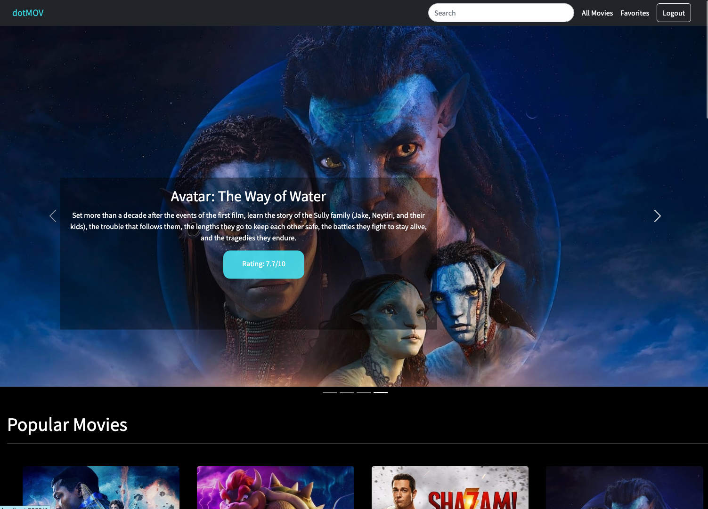
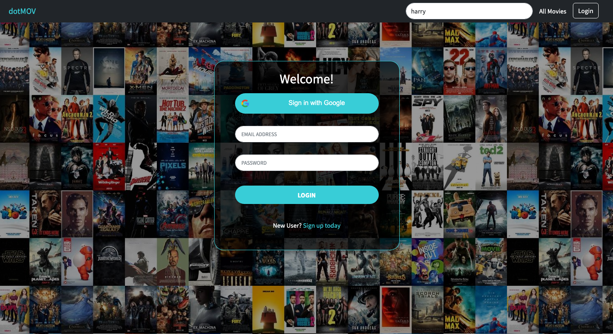

# COP4808 -  Final Project: Group 8 
##  dotMOV
Movie Web Application using TheMovieDB API

## Demo Link
Demo of the application:  
Access the final version of the app here: 

## Table of Content:
- About the app  
Our movie application, called dotMOV, uses The Movie DB API to provide users with a wide selection of movies to browse through. Users can search for specific movies or simply browse through different genres. Users are also able to instantly search for a movie no matter what page they are visiting. Additionally, users can create an account and log in to keep track of their favorite movies, allowing them to easily find and view details of them later. Overall, the app makes it easy for movie enthusiasts to find and keep track of the movies they love.

- Screenshots  
    Home page:
    

    Login/Signup:
    
    

    Favorites:
    

    Search:
    

    GIF of dotMOV
    

- Technologies 
  - React JS
  - Axios 
  - Express
  - MongoDB
  - Node
  - The Movie Database
  
- Setup 

- Approach
- Status
Current
- Credits
- Members 
  - Adrian Echazabal
  - Mahdia Rashid
  - Fatimah Ali
  - Nelly Delgado Planche

