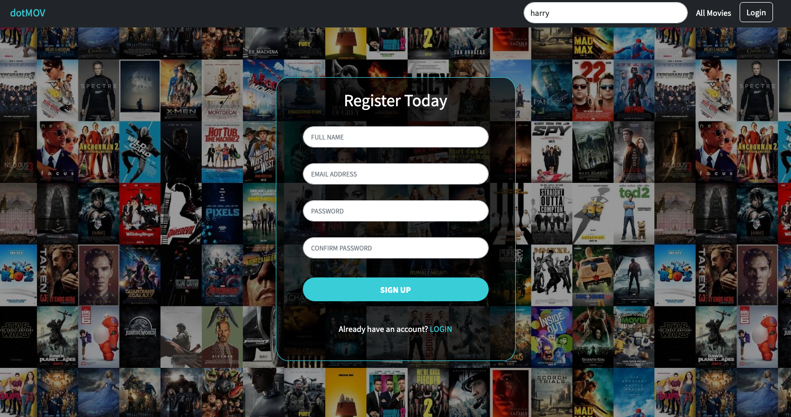
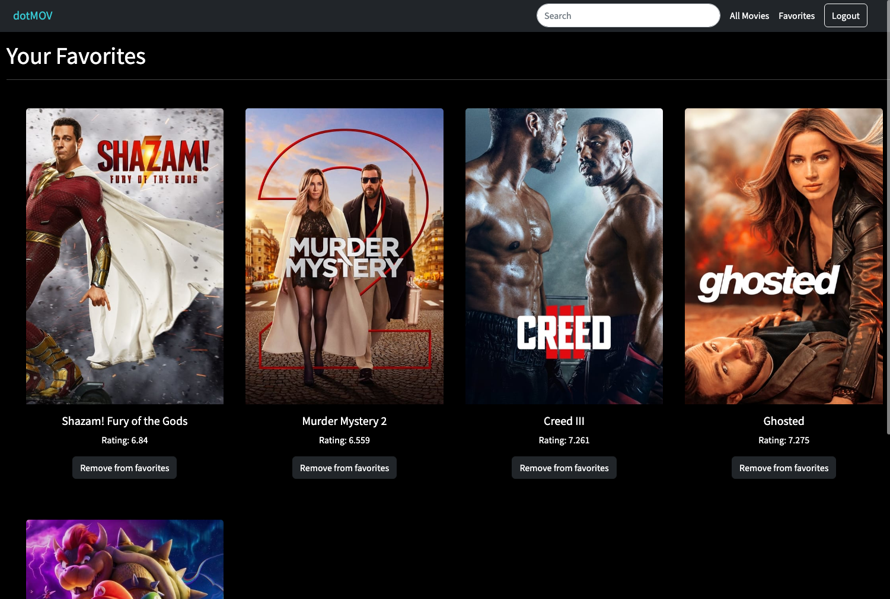
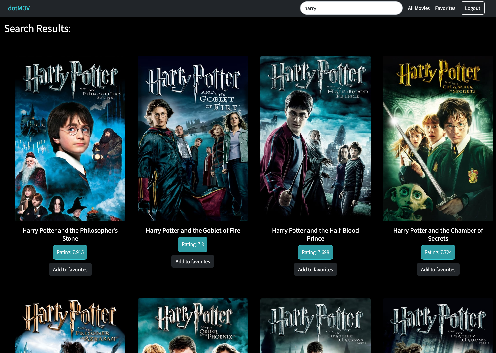

# COP4808 -  Final Project: Group 8 
##  dotMOV
Movie Web Application using TheMovieDB API

## Demo Link
Demo of the application:  
Access the final version of the app here: https://movieserver.herokuapp.com/

## Table of Content:
- About the app  
Our movie application, called dotMOV, uses The Movie DB API to provide users with a wide selection of movies to browse through. Users can search for specific movies or simply browse through different genres. Users are also able to instantly search for a movie no matter what page they are visiting. Additionally, users can create an account and log in to keep track of their favorite movies, allowing them to easily find and view details of them later. Overall, the app makes it easy for movie enthusiasts to find and keep track of the movies they love.

- Screenshots  
    GIF of dotMOV  
    
    
    Home page:
    

    Login/Signup:
    
    

    Favorites:
    

    Search:
    

- Technologies 
  - React JS
  - Axios 
  - Express
  - MongoDB
  - Node
  - The Movie Database
  
- Setup 
     To set up dotMOV in your local machine here are the following steps: 
    1. Clone the GitHub repository to your local machine 
    2. Navigate to the cloned directory by running the following command in your terminal
    3. Create .env file 
    3. Install project dependencies 
    4. Run the react server by doing npm install
    5. Run the backend simulatenously by running node movieserver.js
    6. App should be fully functional and look like the deployed version
    

- Current Status  
    Currently, our application is serving its purpose and we were able to complete all the requirements we set for ourselves. Some extra features we had in mind such as adding a profile section which would display the user favorites as well as allow user to change their personal information was not developed due to time constraints. 

- Credits
    

- Members 
  - Adrian Echazabal
  - Mahdia Rashid
  - Fatimah Ali
  - Nelly Delgado Planche

